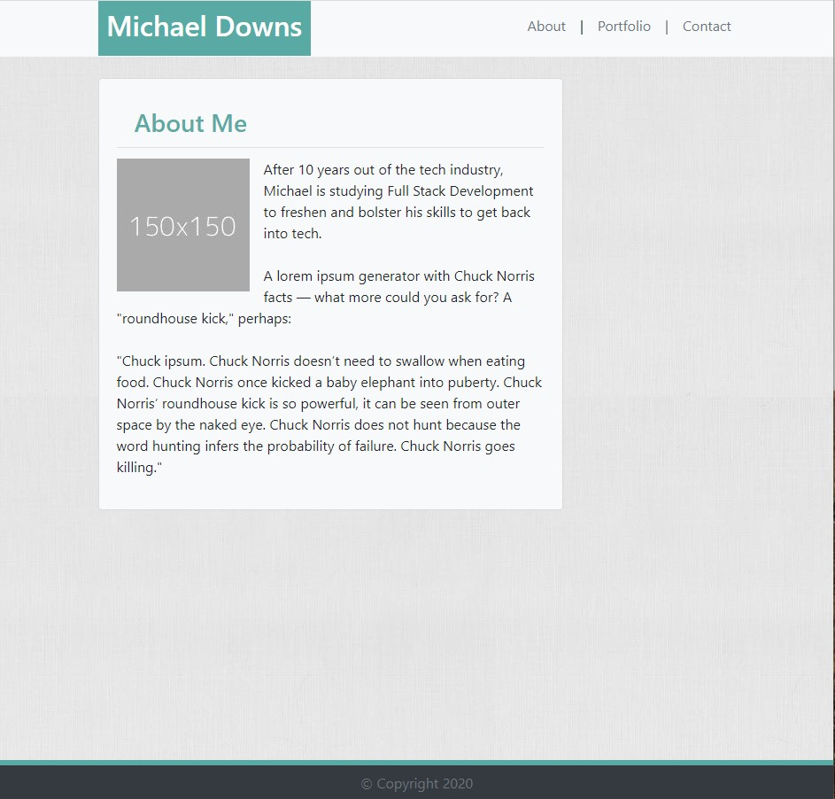

# Responsive Portfolio
Michael Downs portfolio site is a responsive design that renders well on a variety of devies, window and screen sizes.  This site can quickly be adapted to a template or resused for many portfolios in tech or creative. The header and navigation text are top aligned and consistent across all 3 pages with a pipe '|' separating the navigation pages.  Notice the body background is an image and the content background aligns with the header. 
- Index page is all About Me.  
- Portfolio page links to different completed projects.
- Contact page provides an email form to Michael although the email function is disabled.

## Site Picture

## Technologies Used
- HTML - used to make the DOM more semantic and support WEB SEO as well as accessibility
- CSS - styles html elements on the page semantically and support WEB SEO and accesibility
- Git - version control system to track changes to source code
- GITHub - hosts reository taht can be deployed to GitHub Pages
- Photoshop - resize images to make the images a usable byte size for the browser to load.
- Bootstrap - Used the Bootstrap framework to build the Portfolio pages

## Code Snippet
The header and navigaion are used across all three pages.  This page maintains consistency across the pages.  This is a snippet of the code used to make the header and navigation.  This will also demonstrate the use of comments to describe what is happeing in the code.

html
'''

    

    
    <!-- Single column in 1st row holds the Container for the Header and Nav -->
    

        

        <!-- 1st Sub-Row in the 1st Col inside the container that sets the spacing for the header and Nav. -->
        

            <header class="col-md-4 text-center py-2 px-0">
            <h3 class="text-white">Michael Downs</h3>
            </header>
            

            <nav class="nav col-md-4 px-0 mx-0 pt-2 justify-content-center text">
            <a class="nav-link text-muted px-0" href="index.html" >About</a>  |  
            <a class="nav-link active text-muted px-0" href="portfolio.html" >Portfolio</a> |  
            <a class="nav-link text-muted px-0" href="contact.html" >Contact</a>
            </nav>
        

        

    

    

...

## Author Links
### Michael Downs
[LinkedIn](http://www.linkedin.com/in/michaeldownssj)  
[GitHub](https://chindowns.github.io/) 

## Credits
Background Image courtesy of photos-public-domain.com
